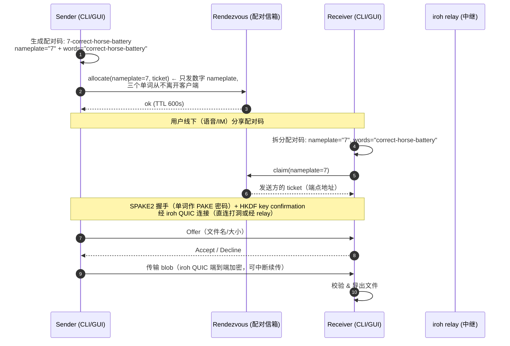

# WordDrop

**跨平台文件互传**：一句话配对码，端到端加密，无需账号，无需公网 IP。

> Cross-platform secure file transfer. Pair with a short word-code, transfer
> end-to-end encrypted, no account or public IP required.

## What / Why（这是什么 / 为什么）

想从一台机器把文件传到另一台机器？不需要注册账号、不需要建房间、不需要公网 IP，
只要念出一句配对码（例如 `7-correct-horse-battery`），传输全程加密。

- **免账号**：没有注册、没有好友关系，配对码一次一用，用完即焚。
- **免公网 IP**：NAT 打洞优先，打洞失败自动走中继（relay）；中继只转发密文。
- **端到端加密**：配对用 SPAKE2（三个单词即密码），传输走 iroh QUIC，内容只有两端可见。
- **可自托管**：配对信箱（rendezvous）与中继（relay）都可自行部署，不依赖第三方云服务。
- **断点续传**：传输中断后重新配对，即可从断点继续。

为什么配对码是「数字 + 三个单词」而不是一个普通密码？数字 nameplate 只在信箱里挂号，
三个单词才是真正的密码，二者在物理上分离。见[安全模型](#security-model-安全模型)。

## Status（状态）

- **v0.2.4 已发布**：[GitHub Releases](https://github.com/koucpy001/worddrop/releases/tag/v0.2.4)，
  提供 Linux / Windows / macOS 与 Android 的预编译产物（见[下载](#download-下载)）。
- **v0.2.4 默认零部署**：开箱即用，默认接入公共基础设施——iroh 公共 relay + EMQX
  公共配对信箱（MQTT），无需注册、无需自建服务、无需任何配置即可互传；需要自建
  时见[部署](#deployment-部署)与[默认 vs 自建](#默认-vs-自建)。
- **仓库公开**：[github.com/koucpy001/worddrop](https://github.com/koucpy001/worddrop)，
  CI 三平台（Linux / Windows / macOS）构建与测试全部通过。
- **Android 已签名**：release APK 使用正式密钥签名（CN=WordDrop），可直接安装。
- **真机验证**：Android 真机清单部分通过（安装、权限、地址配置），传输类步骤因
  手机侧网络问题待复测，暂未声明已验证。

## Download (下载)

Release v0.2.4：<https://github.com/koucpy001/worddrop/releases/tag/v0.2.4>

> **全部为便携版（portable / 绿色版）**：zip 解压即用，无需安装程序，不写入注册表
> 或系统目录，删除即卸载。桌面 GUI 的可执行文件名均为 `worddrop`。

| 资产 | 平台 | 说明 |
| :--- | :--- | :--- |
| `worddrop-linux-cli.zip` | Linux x86_64 | CLI（单个 `worddrop` 二进制） |
| `worddrop-linux-app.zip` | Linux x86_64 | 桌面 GUI（`worddrop` + data/） |
| `worddrop-windows-cli.zip` | Windows x86_64 | CLI（单个 `worddrop.exe`） |
| `worddrop-windows-app.zip` | Windows x86_64 | 桌面 GUI（`worddrop.exe` + DLL） |
| `worddrop-macos-app.zip` | macOS | 桌面 GUI（`WordDrop.app`，未签名） |
| `app-release.apk` | Android（arm64-v8a / armeabi-v7a / x86_64） | release 签名 APK，可直接安装 |
| `worddrop-server-linux.zip` | Linux x86_64 | 局域网服务机专用：`worddrop-rendezvous` + `iroh-relay` 双二进制，零编译 |
| `worddrop-server-windows.zip` | Windows x86_64 | 局域网服务机专用：`worddrop-rendezvous.exe` + `iroh-relay.exe` 双二进制，零编译 |
| `worddrop-server-macos.zip` | macOS（Apple Silicon / arm64） | 局域网服务机专用：`worddrop-rendezvous` + `iroh-relay` 双二进制，零编译 |
| `sha256sums.txt` | - | 前八个 zip 的 SHA-256 校验清单 |

校验下载：`sha256sum -c sha256sums.txt`（Windows 可逐个用
`certutil -hashfile <file> SHA256` 比对）。

## Install (安装)

所有桌面平台均为**解压即用**，无安装程序：

### Linux

```sh
# CLI：解压后放入 PATH
unzip worddrop-linux-cli.zip
chmod +x worddrop-linux-cli/worddrop
install -m 0755 worddrop-linux-cli/worddrop ~/.local/bin/

# 桌面 GUI：解压即用（可选：创建桌面入口）
unzip worddrop-linux-app.zip
./worddrop-linux-app/worddrop
```

也可源码构建：`cargo build --release`（`install -m 0755 target/release/worddrop ~/.local/bin/`）。

### Windows

```sh
# CLI：解压后 worddrop.exe 放入 PATH 即可
unzip worddrop-windows-cli.zip

# 桌面 GUI：解压后双击 worddrop.exe 运行（无需安装）
unzip worddrop-windows-app.zip
```

未签名构建，SmartScreen 可能提示「未知发布者」，点「更多信息」→「仍要运行」。

### macOS

```sh
# 解压后直接使用 .app 目录（绿色版，无需拖入 /Applications）
unzip worddrop-macos-app.zip
open worddrop-macos-app/WordDrop.app
```

未签名构建，Gatekeeper 阻止直接打开时右键点击 `.app` → **打开**
（公证需要付费 Apple Developer 账号，本项目不做）。

### Android

安装 `app-release.apk`（首次需允许「安装未知来源应用」）。release 构建使用正式密钥
签名（CN=WordDrop）；本地缺少 `key.properties` 时回退到 debug 签名，回退包仅用于自用。

## Usage (使用)

### CLI 发送 / 接收

发送方（打印一行配对码）：

```sh
worddrop send ~/photos/vacation/ ~/notes.txt
```

接收方（交互输入配对码，或直接用 `--code` 指定）：

```sh
worddrop receive
worddrop receive --code 7-correct-horse-battery --output ~/Downloads
```

- 配对码格式 `N-word-word-word`：数字为 1-9999 的 nameplate，三个单词取自 256 词
  的 PGP 词表。
- 接收方可选 `-o/--output <dir>` 指定保存目录（默认当前目录）。
- 传输中断后重新执行 `receive`（同一目录、同一数据目录），会提示「继续上次传输?
  [y/N]」，基于已下载的部分继续。

### 配置（服务地址）

客户端通过 `rendezvous_url` / `relay_url` 找到配对信箱和中继。v0.2.4 起**默认即公共
基础设施，无需本机服务、无需任何配置**；只有自建服务（局域网 / 公网）时才需要把
这两个地址指向"跑着服务的那台机器"：

| 场景 | rendezvous / relay 填什么 | 说明 |
| :--- | :--- | :--- |
| 默认（开箱即用） | 无需填写 | 公共配对信箱（EMQX MQTT）+ iroh 公共 relay，见[默认 vs 自建](#默认-vs-自建) |
| 局域网自建 | `http://<服务机IP>:8080` / `:3340` | 其他设备填服务机 IP |
| 公网自建 | `https://pair.你的域名` / `https://relay.你的域名` | 服务部署在公网 VPS（见[部署](#deployment-部署)） |

> ⚠️ **不要在局域网/公网场景填 `127.0.0.1`**：它指"本机自己"。手机填 `127.0.0.1`
> 指的是手机自己——那里没有跑服务。必须填跑服务那台机器的局域网 IP 或公网域名。

配置方式任选（环境变量优先级最高 `env > file > default`）：

```sh
# 方式一：环境变量
export WORDDROP_RENDEZVOUS_URL=http://192.168.1.100:8080
export WORDDROP_RELAY_URL=http://192.168.1.100:3340

# 方式二：配置文件
worddrop config set rendezvous_url http://192.168.1.100:8080
worddrop config set relay_url http://192.168.1.100:3340
worddrop config get
```

| 配置项 | 环境变量 | 默认值 |
| :--- | :--- | :--- |
| rendezvous URL | `WORDDROP_RENDEZVOUS_URL` | `mqtts://broker.emqx.io:8883`（EMQX 公共配对信箱） |
| relay URL | `WORDDROP_RELAY_URL` | `public`（iroh 公共 relay） |
| 数据目录 | `WORDDROP_DATA_DIR` | 平台默认配置目录（按 send/receive 角色分子目录） |
| 配置目录 | `WORDDROP_CONFIG_DIR` | 平台默认配置目录 |

`pair.worddrop.cloud` 与 `relay.worddrop.cloud` 是项目自建示例服务的域名（部署文档
以其为例，见[部署](#deployment-部署)）；需要更快的速度或更强的安全保证时，按
[默认 vs 自建](#默认-vs-自建)自建。GUI 在设置页填写同样的地址，与 CLI 共用一份配置。

### GUI（Flutter）

GUI 与 CLI 共享同一核心（crates/core，经 FRB bridge 调用），界面为中文：

- **传输**（主页）：发送 / 接收两个入口。
- **发送文件**：选文件 → 显示配对码 → 等待对方 → 进度条。
- **接收文件**：输入配对码 → 确认对方文件列表 → 进度条。
- **传输列表**：历史记录（完成 / 失败 / 已取消）。
- **设置**：服务地址、覆盖策略等。

支持平台：Linux desktop、Android。注意：Android 设备上的服务地址不能写
`127.0.0.1`，须填服务端的局域网 IP 或公网地址（默认公共基础设施下无需填写，
此限制仅在自建时生效）。

## Architecture (架构)

### 组件

```
┌─────────────────────┐   ┌─────────────────────┐
│  Sender             │   │  Receiver           │
│  CLI / Flutter GUI  │   │  CLI / Flutter GUI  │
│  ┌───────────────┐  │   │  ┌───────────────┐  │
│  │  worddrop-core │  │   │  │  worddrop-core │  │
│  │  (SPAKE2,     │  │   │  │  (SPAKE2,     │  │
│  │  session,     │  │   │  │  session,     │  │
│  │  iroh blobs)  │  │   │  │  iroh blobs)  │  │
│  └───────┬───────┘  │   │  └───────┬───────┘  │
└──────────┼──────────┘   └──────────┼──────────┘
           │ ① nameplate only        │ ③ claim nameplate
           │   (数字, 无单词)          │
           ▼                          ▼
     ┌─────────────────────────────────────┐
     │  worddrop-rendezvous (配对信箱)        │
     │  code <-> ticket · one-shot claim   │
     │  TTL 600s · rate limits · /health   │
     └─────────────────────────────────────┘
           ▲                          ▲
           │ ② SPAKE2 over iroh       │
           │    (单词是密码, 只走 iroh)  │
           └────────────┬─────────────┘
                        ▼
              ┌─────────────────────┐
              │  iroh relay (中继)   │
              │  只转发密文, 无法解密  │
              │  NAT 打洞失败时兜底    │
              └─────────────────────┘
```

### 配对流程 (pairing flow)



关键点：**nameplate 与 words 分离**。rendezvous 只见数字 nameplate（挂号用），
words（真正的密码）只存在于两端客户端之间、经 SPAKE2 协商，永不经过 rendezvous
（上述为自建 HTTP rendezvous 的架构；默认公共 MQTT 模式向 broker 暴露的是
nameplate+words 的慢 KDF 承诺，见安全模型「公共信箱（MQTT）模式」）。

## Security model (安全模型)

### 分层：谁能看到什么

| 组件 | 能看到 | 不能看到 |
| :--- | :--- | :--- |
| rendezvous（配对信箱） | 数字 nameplate、ticket（端点地址）、时间戳 | 三个单词、会话密钥、文件内容 |
| iroh relay（中继） | 密文流（QUIC 载荷）、元数据流量 | 明文文件、配对密码 |
| 网络嗅探者 | 与 relay 相同（未用 TLS 时含 nameplate/ticket 明文） | 单词、文件内容 |
| 对方客户端 | 协商后的文件内容 | 你的持久身份密钥（ed25519，本地保存） |

### 1. nameplate / password 拆分

配对码 `N-word-word-word` 拆成两部分，职责完全分离：

- **nameplate**（数字 1-9999）：只是信箱里的「挂号号牌」。客户端把它发给
  rendezvous，用于让对方找到自己。它本身没有任何秘密，任何人看到 `7` 都毫无意义。
- **三个单词**：真正的密码（PAKE 密码）。**从不离开客户端**，不经过 rendezvous、
  不经过 relay，只参与两端的 SPAKE2 协议。

这个拆分是安全模型的根基：即使 rendezvous 被攻破，攻击者拿到的也只是
「有人用号码 7 挂号了」这类信息，**得不到任何能冒充发送方或解密传输的东西**。
（以上为自建 HTTP rendezvous 的保证；默认公共 MQTT 模式经公共 broker 暴露的是
nameplate+words 的慢 KDF 承诺，性质不同，见下文「公共信箱（MQTT）模式」小节。）

### 2. SPAKE2 配对认证

- 三个单词即 PAKE（Password-Authenticated Key Exchange）密码，两端各发一条 33
  字节消息，派生 32 字节会话密钥。
- 随后做 **HKDF key confirmation**（16 字节确认令牌）：只有单词完全一致的两端
  才能通过确认；单词不一致 → 确认失败 → 配对终止，不传输任何数据。
- PAKE 的性质：密码从不以可离线破解的形式出现在线上（无明文传输、无字典攻击面）。

### 3. iroh QUIC 传输层端到端加密

文件内容走 iroh（QUIC-over-TLS）连接传输，**端到端加密**。relay 的角色是
「不知道内容的快递员」：它转发的是密文，无法读取文件内容，也无法解密。

### 威胁模型（Threat model）

> **诚实声明**：说「relay 无法解密」的前提是 iroh 传输层端到端加密成立。
> 而 E2E 之所以可信，恰恰来自下面的 nameplate/words 拆分：早期设计若把完整
> 配对码交给 rendezvous，恶意 rendezvous 就能直接中间人（MITM）。正是
> nameplate/words 拆分 + SPAKE2 封死了这条路。

- **恶意/被攻破的 rendezvous**：它可以**替换 ticket**，把接收方引导到攻击者自己
  的节点。但攻击者拿不到三个单词，就无法通过 key confirmation，接收方会在配对
  阶段发现（确认失败），不会传输任何文件。**这就是 SPAKE2 的意义**：它把
  「信箱管理员不可信」变成了「信箱管理员捣乱也没用」。（此保证针对自建 HTTP
  rendezvous；默认公共 MQTT 模式不提供同等保证，见下文「公共信箱（MQTT）模式」。）
- **恶意/被攻破的 relay**：oblivious（视而不见）。它只能转发密文，没有解密密钥。
  即使 relay 与 rendezvous 串通，也只能做 ticket 替换级别的干扰，依然过不了
  SPAKE2 配对关。
- **网络嗅探者**：生产环境走 TLS（relay 是 wss，rendezvous 是 https），嗅探者
  看到的是密文；即使看到 nameplate/ticket 明文（dev 模式），也没有任何秘密可言。
- **重放攻击**：nameplate 一次性 claim，claim 后立即作废（one-shot），重复 claim
  返回 404；TTL 600s 过期即失效。
- **离线暴力破解（自建 HTTP 模式）**：256 词词表取 3 个不同单词，组合空间 256×255×254 ≈ 1.66×10⁷。
  数字不大，但 SPAKE2 的 key confirmation 使每次猜测都需要一次实时握手（不能离线
  批量验证），且 rendezvous 有速率限制、配对码 600s 过期，对在线猜测的防护足够。

**残余风险（诚实列出）**：

1. 三个单词只有约 24 bits 熵，不要把配对码发到公开场合；语音/私聊传递是设计预期
   场景。
2. dev 模式（relay `--dev` + 无 TLS rendezvous）下 nameplate/ticket 明文传输，
   局域网嗅探者能看到谁在跟谁配对（看不到内容）。生产必须 TLS。
3. 身份密钥（ed25519）保存在本地；丢 key 不会丢文件，但会换身份。

### 公共信箱（MQTT）模式

v0.2.4 起默认配对信箱是 **EMQX 公共 broker（MQTT）**（`mqtts://broker.emqx.io:8883`），
与自建 HTTP rendezvous 的安全性质不同。以下逐条如实声明：

- **(a) 配对 topic 的派生与暴力空间**：配对 topic 由「nameplate+words」经
  **Argon2id（memory-hard KDF）**派生，nameplate 折进密码，暴力空间
  9999×256×255×254 ≈ 1.66×10¹¹（约 263 CPU-years 的成本）；words 本身熵约
  24-bit。即使使用慢 KDF，也**无法从数学上消除离线暴力**，只是把成本抬高到
  不可行。这与 HTTP 模式「words 绝不离开客户端」的保证不同：**MQTT 模式向
  公共 broker 暴露了（nameplate+words）的慢 KDF 承诺**。
- **(b) 通配订阅批量收集**：公共 broker 上任何人可 `worddrop/v1/#` 通配订阅，
  批量获取全部 retained ticket 与 topic 哈希（HTTP 模式则按 nameplate 限速
  claim）。ticket 没有 words 无法通过 SPAKE2 配对，但 endpoint 元数据可被
  批量收集（谁在什么时间从什么地址配对）。
- **(c) retained 无服务端 TTL 保证**：ticket 在 claim/清理后被空消息删除，但
  公共 broker 没有服务端 TTL 保证；若发送方异常退出且未清理，ticket 可能存留。
  客户端退出路径的 best-effort 清理已降低该风险，但无法完全消除。
- **(d) 强保证需自建 HTTP rendezvous**：需要「信箱管理员捣乱也没用」级强保证的
  用户，应自建 HTTP rendezvous（方案 A/B）——**默认公共 MQTT 模式不提供同等保证**。

> 结论：默认公共 MQTT 模式适合日常零配置体验；敏感场景请自建 HTTP rendezvous，
> 顺带获得满速与（大陆）备案后的稳定访问。

## Deployment (部署)

### 为什么需要部署？什么时候需要？

WordDrop 是 P2P 传输工具，**两个服务都不在传输链路上**，它们是"可用性增强器"：

- **rendezvous（配对信箱）**：解决"怎么找到对方"——发送方拿数字号牌挂号，接收方凭号牌取回地址。只看到数字 nameplate，看不到单词密码和文件。
- **iroh relay（中继）**：解决"连不上怎么办"——NAT 打洞失败时兜底转发**密文**，无法解密。

| 场景 | 需要部署吗 | 怎么传 |
| :--- | :--- | :--- |
| 默认（开箱即用） | ❌ 不需要 | 公共配对信箱（EMQX MQTT）+ iroh 公共 relay，见[默认 vs 自建](#默认-vs-自建) |
| 同一局域网 | ⚠️ 一台设备跑服务 | 直连打洞即可，服务只需 rendezvous（relay 基本闲置） |
| 跨公网 / NAT | ✅ 需要 | 打洞优先，失败走 relay |

### 默认 vs 自建

| 对比项 | 默认（开箱即用） | 自建（方案 A/B） |
| :--- | :--- | :--- |
| 配对信箱 | EMQX 公共 broker（`mqtts://broker.emqx.io:8883`） | `https://pair.你的域名` |
| 中继 | iroh 公共 relay（`public`） | `https://relay.你的域名` |
| 配置 | 无需任何配置 | 两端 `worddrop config set` 指向自己的域名 |
| 速度 / 稳定性 | 公共资源：**可能限速、无 SLA** | **满速**，自己掌控 |
| 安全保证 | 公共 MQTT 模式（见安全模型「公共信箱（MQTT）模式」） | 自建 HTTP rendezvous，提供完整保证 |
| 大陆访问 | 无需备案（公共设施在海外） | 自建服务器在大陆时**域名需 ICP 备案**，否则大陆 80/443 被拦截（见 [`deploy/ICP-filing.md`](deploy/ICP-filing.md)） |

> 一句话：默认零部署，开箱即用；要满速、要「信箱管理员捣乱也没用」的强保证，就自建。

### 服务器二进制从哪来？

v0.2.4 起 release 已提供**服务器 zip**（`worddrop-server-<平台>.zip`，含
rendezvous + relay 双二进制，零编译，见[下载](#download-下载)）：

- **方案 A（局域网）**：直接下载服务器 zip，解压即用（见下文）。
- **方案 B（公网）**：Docker Compose 自动构建（见下文"公网部署"）。
- **源码构建备选**：`cargo build --release -p worddrop-rendezvous`（中继
  `cargo install iroh-relay --version 1.0.3 --features server`）。

### 方案 A：局域网快速部署（下载即用，零编译）

在局域网里**任选一台常开设备**作为服务机（Windows / macOS / Linux 桌面均可，
无需额外机器），所有设备在同一局域网即可。

**步骤 1：下载**

从 [GitHub Releases](https://github.com/koucpy001/worddrop/releases) 下载：

- 服务器 zip：`worddrop-server-<平台>.zip`（按服务机系统选 Linux / Windows / macOS）
- 客户端 zip：`worddrop-<平台>-cli.zip` 或 app zip（每台收发设备）

**步骤 2：解压**

解压服务器 zip，得到两个二进制：`worddrop-rendezvous`（配对信箱，**必需**）+
`iroh-relay`（中继，可选兜底）。

**步骤 3：启动服务（两个终端或 nohup）**

Linux / macOS：

```sh
# 配对信箱（必需）——必须绑 0.0.0.0，其他设备才能连
WORDDROP_RENDEZVOUS_ADDR=0.0.0.0:8080 ./worddrop-rendezvous
# 中继（可选，局域网打洞几乎必成功，可跳过）——--dev 模式跑纯 HTTP，监听 3340
./iroh-relay --dev
```

Windows（PowerShell）：

```powershell
# 配对信箱（必需）——必须绑 0.0.0.0，其他设备才能连
$env:WORDDROP_RENDEZVOUS_ADDR="0.0.0.0:8080"; .\worddrop-rendezvous.exe
# 中继（可选，局域网打洞几乎必成功，可跳过）——--dev 模式跑纯 HTTP，监听 3340
.\iroh-relay.exe --dev
```

**步骤 4：查服务机局域网 IP**

- Windows：`ipconfig`（IPv4 地址）
- Linux / macOS：`ip addr`（`ip addr | grep 'inet ' | grep -v 127.0.0.1`）

例如 `192.168.1.100`。

**步骤 5：客户端配置（每台设备，包括服务机自己）**

```sh
# 服务机自己：
worddrop config set rendezvous_url http://127.0.0.1:8080
# 其他设备（手机 / 另一台电脑）：
worddrop config set rendezvous_url http://192.168.1.100:8080
# relay 同理：跑了就填 relay_url http://<服务机IP>:3340，没跑就不填
worddrop config set relay_url http://192.168.1.100:3340
```

> 资源占用实测：rendezvous ~2.5 MiB、relay ~2.3 MiB、CPU 接近 0。任何设备都能当服务机。
> 局域网内 rendezvous 是必需（配对流程依赖），relay 基本闲置但保留地址以防打洞失败。

> **零编译**：服务器二进制已随 release 提供；如想源码构建：
> `cargo build --release -p worddrop-rendezvous`（+ `cargo install iroh-relay --version 1.0.3 --features server`）。
> macOS 服务器 zip 为 **Apple Silicon（arm64）**；Intel Mac 用户请源码构建，
> 或自取官方 x86_64 relay（`iroh-relay-v1.0.3-x86_64-apple-darwin.tar.gz`）+ 源码编译 rendezvous。

### 方案 B：公网部署（VPS + Docker Compose，含自动 HTTPS）

前置条件：

- 一台有公网 IP 的 VPS（最低 1 核 512M 即可，整套 <20 MiB 内存）
- 一个域名，解析两个子域到 VPS（如 `pair.example.com`、`relay.example.com`）
- 防火墙放行 **80/443 TCP**（Caddy 负责 TLS；**不需要开任何 UDP 端口**）
- **ICP 备案**：VPS 在大陆（如腾讯云）时，未备案域名的大陆 80/443 流量会被拦截
  （实测：80→302 提示页、443→RST），必须先完成 ICP 备案，材料清单与流程见
  [`deploy/ICP-filing.md`](deploy/ICP-filing.md)

```sh
# 1. 拉取仓库到 VPS
git clone https://github.com/koucpy001/worddrop.git
cd worddrop/deploy

# 2. 把 Caddyfile 里的两个域名换成你自己的
#    （把 pair.worddrop.cloud / relay.worddrop.cloud 替换为你的域名）
sed -i 's/pair.worddrop.cloud/pair.example.com/g; s/relay.worddrop.cloud/relay.example.com/g' Caddyfile

# 3. 启动（首次构建约 10-20 分钟编译 Rust，之后增量秒级）
docker compose up -d --build

# 4. 验证
docker compose ps                 # 四个容器全部 Up (healthy)
curl -fsSL https://pair.example.com/health     # → ok
curl -fsSL https://relay.example.com/          # → "Iroh Relay" 页面
```

客户端两端指向你的域名：

```sh
worddrop config set rendezvous_url https://pair.example.com
worddrop config set relay_url https://relay.example.com
```

**原理**：Caddy 独占 80/443，自动向 Let's Encrypt 申请并续期两个域名的证书（零人工），
把 `pair` 反代到 rendezvous :8080、`relay`（含 WebSocket /relay）反代到 relay :80。
证书持久化在 `caddy-data` 卷，重建容器不丢。详见 [`deploy/README.md`](deploy/README.md)。

### 方案 C：默认即公共基础设施（零部署、零配置）

v0.2.4 起**默认即为公共基础设施**：配对信箱走 EMQX 公共 broker（MQTT），中继走
iroh 公共 relay。**无需任何配置**，开箱即用：

```sh
worddrop send ~/photos/vacation/
worddrop receive
```

> ⚠️ 公共资源按"尽力而为"运维（无 SLA、可能限速），且默认公共 MQTT 模式的安全
> 保证弱于自建 HTTP rendezvous（见安全模型「公共信箱（MQTT）模式」）。正式或敏感
> 使用建议自建（方案 A/B）；`pair.worddrop.cloud` / `relay.worddrop.cloud` 仅作
> 自建示例域名出现（部署示例见 [`deploy/README.md`](deploy/README.md)）。

### 运维要点

- **版本固定**：iroh-relay 与客户端 iroh 必须都是 **1.0.3**，升级需两端同步。
- **证书续期**：Caddy 自动续期，无需人工介入。
- **安全**：relay 转发的是 iroh QUIC 密文（端到端加密），它看不到文件内容；生产环境
  必须走 TLS（Caddy 已处理），不要直接暴露 8080/3340/9090 到公网。
- 完整文档（systemd 裸机方案、防火墙明细、TLS 原理）：**[`deploy/README.md`](deploy/README.md)**。

## Development (开发指南)

### 环境准备

| 依赖 | 版本 | 说明 |
| :--- | :--- | :--- |
| Rust toolchain | 1.97.1 | `rust-toolchain.toml` 已固定 |
| Flutter | 3.44.9 (Dart 3.12.2) | Linux desktop 需要 clang / ninja-build / pkg-config / libgtk-3-dev / liblzma-dev |
| Android SDK | AGP 8.11.1 + Kotlin 2.2.20 + NDK 28.x | 仅构建 Android 需要（minSdk 26） |
| iroh-relay | 1.0.3 | 本地 e2e 与联调的硬依赖，`cargo install iroh-relay --version 1.0.3 --features server` |

中国大陆网络可配置 rsproxy 镜像加速 crates.io（CI 无需配置，runner 可直连）。

### 本地运行

```sh
# 1. 起 relay（dev 模式，端口 3340）
iroh-relay --dev

# 2. 起 rendezvous（默认 127.0.0.1:8080）
worddrop-rendezvous

# 3. 两个终端分别发送 / 接收
worddrop send <path>
worddrop receive --code <word-code>
```

内存紧张的主机建议用 `-j 2` 构建。send 与 receive 的数据目录按角色分离
（`<data_dir>/send`、`<data_dir>/receive`），不要手动改到一起（iroh-blobs 的
redb 数据库是单进程独占的）。

### 测试

```sh
cargo test --workspace -j 2          # Rust 全量（含 7 个端到端用例）
cargo test -j 2 -p worddrop_bridge --manifest-path flutter/rust/Cargo.toml  # FRB 桥接层
cd flutter/app && flutter test       # Flutter widget 测试（hermetic）
cargo clippy --workspace -- -D warnings
cargo fmt --check
```

端到端用例依赖 `~/.cargo/bin/iroh-relay`（先查该路径再查 `PATH`）。

## License

MIT，见 [LICENSE](LICENSE)。
