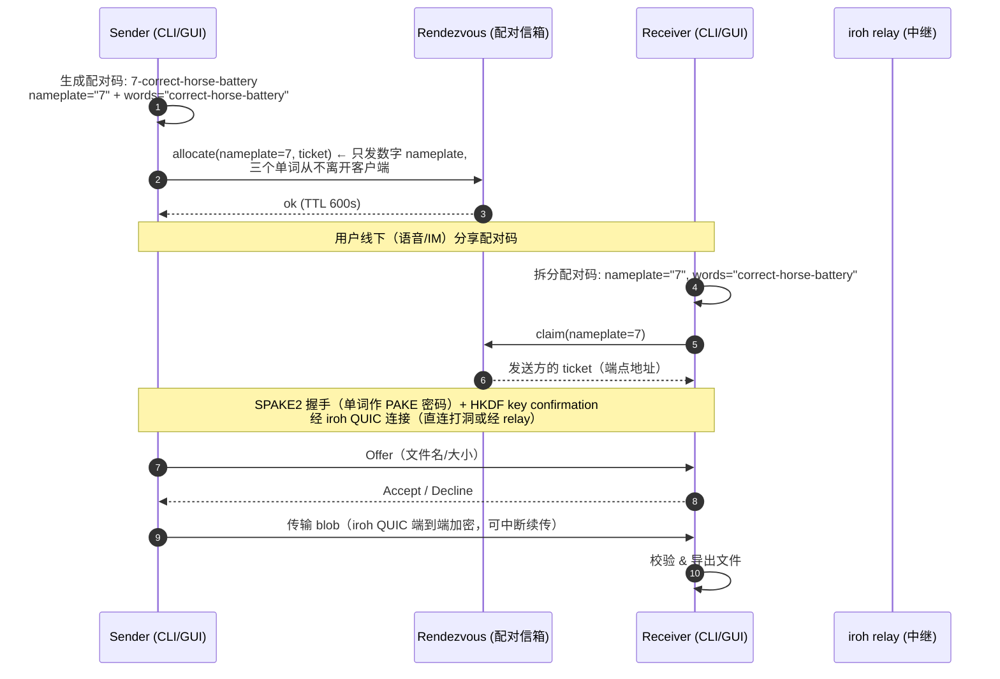

# WordDrop

跨平台 WAN 文件传输：Windows GUI、macOS GUI、Linux CLI、Android。通过一段简短的
单词配对码（`nameplate-word-word-word`）配对，文件端到端加密传输，支持中断续传。
可自托管配对服务（rendezvous）与传输中继（iroh relay），传输稳定可控。

Cross-platform WAN file transfer: Windows GUI, macOS GUI, Linux CLI, Android.
Pair with a short word-code phrase (`nameplate-word-word-word`), transfer files
end-to-end encrypted with resumable progress. Self-host the rendezvous + relay
for stable transfers.

## What / Why（这是什么 / 为什么）

**TL;DR**：想从一台机器把文件传到另一台机器，不登录账号、不建房间、不用公网 IP，
只凭一句人话（比如 `7-correct-horse-battery`）就能配对，传输全程加密。

- **不要账号**：没有注册、没有好友关系。配对码是一次性的，用完即焚。
- **不要公网 IP**：NAT 打洞优先，打洞失败自动走中继（relay）。中继只转发密文。
- **不怕偷听**：配对用 SPAKE2（单词即密码），传输用 iroh QUIC 端到端加密。
- **可自托管**：配对信箱（rendezvous）和中继（relay）都是自己的，不依赖第三方云服务。
- **可断点续传**：传输中断后重新配对即可从断点继续。

为什么是「数字 + 三个单词」而不是一个普通密码？见[安全模型](#security-model-安全模型)——
数字 nameplate 只用于在信箱里挂号，三个单词才是真正的配对密码，二者在物理上分离。

## Status（状态）

- 原计划（`.omo/plans/my-croc.md`）**29/29 全部完成**：25 个实现 todos + F1-F4 最终验证 wave。
- 核心逻辑、CLI、GUI、Android APK、部署产物全部本地构建并测试通过；生产服务已上线
  worddrop.cloud（TLS 由 Caddy 终结，见[部署指南](#deployment-guide-部署指南)）。
- 仓库已公开（[github.com/koucpy001/worddrop](https://github.com/koucpy001/worddrop)），
  CI 三平台（ubuntu / windows / macos）全绿——主分支 run
  [31554042951](https://github.com/koucpy001/worddrop/actions/runs/31554042951) 与
  tag v0.2.0 run [31555395399](https://github.com/koucpy001/worddrop/actions/runs/31555395399)
  均 success。预编译产物见 [Release v0.2.0](#download-下载)。
- Android 真机测试清单已于 2026-08-12 在 vivo <DEVICE_MODEL> 上实际执行（T8）：安装、权限、
  地址配置等步骤 1-4 通过；传输类步骤 5-7 因手机侧网络路径问题阻塞，传输未经受验证
  （详见下方清单与 `.omo/evidence/my-croc-prod/task-8-my-croc-prod.txt`）。
- 版本：CLI `worddrop 0.2.0`（编译期 `CARGO_PKG_VERSION`），Flutter app `0.2.0+1`。
- 已知目标偏差（诚实记录）：CLI 二进制 ~10MB（iroh 依赖树，<5MB 目标未达）；
  APK 83MB（3-ABI cdylib + Flutter engine，<25MB 目标未达）。详见 `.omo/evidence/my-croc/`。

## Layout（代码结构）

- `crates/core` — pairing (SPAKE2 word-code), session state machine, iroh transfer engine, persistent identity, resume records
- `crates/rendezvous` — axum mailbox server (code <-> ticket, one-shot claim, TTL, rate limits)
- `crates/cli` — Linux CLI (send/receive by word code)
- `flutter/app` — Flutter GUI (Linux desktop + Android), native bridge via flutter_rust_bridge + cargokit
- `deploy/` — Docker Compose + systemd 部署产物（见[部署](#deployment-guide-部署指南)）

## Download (下载)

Release v0.2.0：<https://github.com/koucpy001/worddrop/releases/tag/v0.2.0>
（仓库已公开；v* tag 推送自动触发 3-OS 构建并发布到 Release）

| 资产 | 平台 | 说明 |
| :--- | :--- | :--- |
| `worddrop-linux-cli.zip` | Linux x86_64 | CLI（`worddrop`） |
| `worddrop-linux-app.zip` | Linux x86_64 | Flutter GUI（Linux desktop） |
| `worddrop-windows-cli.zip` | Windows x86_64 | CLI（`worddrop.exe`） |
| `worddrop-windows-app.zip` | Windows x86_64 | Flutter GUI |
| `worddrop-macos-app.zip` | macOS | Flutter GUI（未签名） |
| `app-release.apk` | Android（arm64-v8a / armeabi-v7a / x86_64） | release 签名 APK（CN=WordDrop，可直接安装） |
| `sha256sums.txt` | - | 前五个 zip 的 sha256 校验清单 |

校验下载：`sha256sum -c sha256sums.txt`（Windows 可用 `certutil -hashfile <file> SHA256`
逐个比对）。Windows/macOS 包未签名，安装时的系统警告见下文对应章节。

## Install (安装)

### Linux CLI

版本从 `cargo build` 时的 `Cargo.toml` 编译进二进制（`worddrop --version`），无运行时 env 覆盖。

两种方式任选其一：

1. 源码构建（推荐，当前版本）：

   ```sh
   cargo build --release -j 2          # release profile: opt-level=z, lto, strip
   install -m 0755 target/release/worddrop ~/.local/bin/
   ```

2. 下载预编译二进制：从 [Release v0.2.0](https://github.com/koucpy001/worddrop/releases/tag/v0.2.0)
   下载 `worddrop-linux-cli.zip`，解压后 `chmod +x worddrop` 并放入 `PATH`。
   本机不提供静态链接（依赖系统 glibc）。

用法：`worddrop send <file...>` / `worddrop receive --code <word-code>`（详见 `--help`）。

### Android（APK / AAB）

Release 包在 `flutter/app/build/app/outputs/` 下：

- APK：`flutter-apk/app-release.apk` — 直接安装：`adb install -r` 或拷贝到手机
  （首次需允许"安装未知来源应用"）。
- AAB：`bundle/app-release.aab` — 用于上架 Google Play 商店（当前未上架，仅本地构建产物）。

签名说明：release 构建使用正式密钥签名（CN=WordDrop，keystore 在仓库外、经
gitignored 的 `key.properties` 引用，模板见 `key.properties.example`）；本机缺
`key.properties` 时回退到 debug 签名（CI/本地构建仍可工作，回退包仅用于自用安装）。
Release 里的 `app-release.apk` 是正式签名包。

### Windows / macOS GUI（Release 构建，未签名）

本开发机为 Linux 主机，无法本地构建 Windows/macOS 目标——`worddrop.exe` 与
macOS `.app` 由 GitHub Actions 在 v* tag 推送时自动构建并发布到
[Release](https://github.com/koucpy001/worddrop/releases)（见 [Download](#download-下载)）。
两个平台均为**未签名**构建，安装时会有系统警告：

- **Windows**：SmartScreen 会提示"未知发布者"。点击"更多信息" → "仍要运行"即可
  （Microsoft Defender 无法验证发布者，因为二进制未签名）。
- **macOS**：Gatekeeper 会阻止直接打开（未签名 + 未公证）。右键点击 `.app` →
  **打开**（Open）→ 再次确认即可。注意：公证（notarization）需要付费 Apple
  Developer 账号，本项目明确不做（out of scope）。

## Usage (使用)

### CLI 发送 / 接收

发送方（会打印一行配对码）：

```sh
worddrop send ~/photos/vacation/ ~/notes.txt
```

接收方（交互输入配对码，或直接用 `--code` 指定）：

```sh
worddrop receive
worddrop receive --code 7-correct-horse-battery --output ~/Downloads
```

输出示例（发送方，非 TTY 下进度自动降级为纯文本行）：

```text
配对码: 7-correct-horse-battery
等待对方配对... (code: 7)
传输中: 45.2 MiB / 100 MiB (45%)
传输完成: /home/user/photos/vacation → 对方
```

- 配对码格式：`N-word-word-word`（如 `7-correct-horse-battery`），数字为 1-9999 的
  nameplate，三个单词取自 256 词的 PGP 词表。
- 接收方可选 `-o/--output <dir>` 指定保存目录（默认当前目录）。
- 传输中断后重新执行 `receive`（同一目录、同一 data dir），会提示"继续上次传输? [y/N]"，
  基于已下载的部分继续（断点续传）。

### 配置（自托管服务地址）

客户端默认指向本机（`http://127.0.0.1:8080` rendezvous + `http://127.0.0.1:3340` relay）。
使用自托管服务时，两端都要设置。两种方式：环境变量（优先级最高）或配置文件。
生产（公网 TLS，worddrop.cloud）与开发（LAN，http）用同一套机制，仅地址不同。

**生产（worddrop.cloud，公网 TLS）**：

```sh
# 方式一：环境变量
export WORDDROP_RENDEZVOUS_URL=https://pair.worddrop.cloud
export WORDDROP_RELAY_URL=https://relay.worddrop.cloud

# 方式二：配置文件（config.toml，保存在配置目录）
worddrop config set rendezvous_url https://pair.worddrop.cloud
worddrop config set relay_url https://relay.worddrop.cloud
worddrop config get          # 查看生效配置（env > file > default）
```

**开发 / 局域网（LAN dev 路径）**：

```sh
export WORDDROP_RENDEZVOUS_URL=http://<host>:8080
export WORDDROP_RELAY_URL=http://<host>:3340
```

| 配置项 | 环境变量 | 默认值 |
| :--- | :--- | :--- |
| rendezvous URL | `WORDDROP_RENDEZVOUS_URL` | `http://127.0.0.1:8080` |
| relay URL | `WORDDROP_RELAY_URL` | `http://127.0.0.1:3340` |
| 数据目录 | `WORDDROP_DATA_DIR` | 配置目录（按 send/receive 角色分子目录） |
| 配置目录 | `WORDDROP_CONFIG_DIR` | 平台默认配置目录 |

GUI：设置页（设置 tab）填写 rendezvous / relay 地址，与 CLI 同一份配置（填上面的
生产或开发地址均可）。

### GUI（Flutter）

GUI 与 CLI 共享同一核心（crates/core，经 FRB bridge 调用）。界面为中文，五个界面：

- **传输**（主页）：发送文件 / 接收文件两个入口。
- **发送文件**：选文件（系统文件选择器）→ 显示配对码 → 等待对方 → 进度条。
- **接收文件**：输入配对码 → 显示对方文件列表（确认/拒绝对话框）→ 进度条。
- **传输列表**：历史记录（状态：完成/失败/已取消）。
- **设置**：服务地址、覆盖策略等。

支持平台：Linux desktop、Android（Linux desktop 仅用于本地验证；真机测试清单见下文；
Android 设备上的服务地址**不能写 `127.0.0.1`**，须填宿主机的局域网 IP）。

## Architecture (架构)

### 组件

```
┌─────────────────────┐   ┌─────────────────────┐
│  Sender             │   │  Receiver           │
│  CLI / Flutter GUI  │   │  CLI / Flutter GUI  │
│  ┌───────────────┐  │   │  ┌───────────────┐  │
│  │  worddrop-core │  │   │  │  worddrop-core │  │
│  │  (SPAKE2,     │  │   │  │  (SPAKE2,     │  │
│  │  session,     │  │   │  │  session,     │  │
│  │  iroh blobs)  │  │   │  │  iroh blobs)  │  │
│  └───────┬───────┘  │   │  └───────┬───────┘  │
└──────────┼──────────┘   └──────────┼──────────┘
           │ ① nameplate only        │ ③ claim nameplate
           │   (数字, 无单词)          │
           ▼                          ▼
     ┌─────────────────────────────────────┐
     │  worddrop-rendezvous (配对信箱)        │
     │  code <-> ticket · one-shot claim   │
     │  TTL 600s · rate limits · /health   │
     └─────────────────────────────────────┘
           ▲                          ▲
           │ ② SPAKE2 over iroh       │
           │    (单词是密码, 只走 iroh)  │
           └────────────┬─────────────┘
                        ▼
              ┌─────────────────────┐
              │  iroh relay (中继)   │
              │  只转发密文, 无法解密  │
              │  NAT 打洞失败时兜底    │
              └─────────────────────┘
```

### 配对流程 (pairing flow)



关键点：**nameplate 与 words 分离**。rendezvous 只见数字 nameplate（挂号用），
words（真正的密码）只存在于两端客户端之间、经 SPAKE2 协商，永不经过 rendezvous。

## Security model (安全模型)

### 分层：谁能看到什么

| 组件 | 能看到 | 不能看到 |
| :--- | :--- | :--- |
| rendezvous（配对信箱） | 数字 nameplate、ticket（端点地址）、时间戳 | 三个单词、会话密钥、文件内容 |
| iroh relay（中继） | 密文流（QUIC 载荷）、元数据流量 | 明文文件、配对密码 |
| 网络嗅探者 | 与 relay 相同（若未用 TLS 则含 nameplate/ticket 明文） | 单词、文件内容 |
| 对方客户端 | 协商后的文件内容 | 你的持久身份密钥（ed25519，本地保存） |

### 1. nameplate / password 拆分（Oracle F1 核心设计）

配对码 `N-word-word-word` 拆成两部分，职责完全分离：

- **nameplate**（数字 1-9999）：只是信箱里的「挂号号牌」。客户端把它发给
  rendezvous，用于让对方能找到自己。它本身没有任何秘密——任何人看到 `7`
  都毫无意义。
- **三个单词**：真正的密码（PAKE 密码）。**从不离开客户端**，不经过 rendezvous，
  不经过 relay，只参与两端的 SPAKE2 协议。

这个拆分是安全模型的根基：即使 rendezvous 被攻破，攻击者拿到的也只是
「有人用号码 7 挂号了」这样的信息，**得不到任何能冒充发送方或解密传输的东西**。

### 2. SPAKE2 配对认证

- 单词即 PAKE（Password-Authenticated Key Exchange）密码，两端用
  `spake2 0.4.0` 的 `start_symmetric` 各发一条 33 字节消息，派生 32 字节会话密钥。
- 随后做 **HKDF key confirmation**（16 字节确认令牌，info 为 `worddrop/confirm`）：
  只有单词完全一致的两端才能通过确认。单词不一致 → 确认失败
  （`ConfirmationMismatch`）→ 配对终止，不传输任何数据。
- PAKE 的性质：密码从不以可离线破解的形式出现在线上（无明文传输、无字典攻击面）。

### 3. iroh QUIC 传输层端到端加密

文件内容走 iroh（QUIC-over-TLS）连接传输，**端到端加密**。relay 的角色是
「不知道内容的快递员」：它转发的是密文，无法读取文件内容，也无法解密。

### 威胁模型（Threat model）

> ⚠️ **诚实声明**：说「relay 无法解密」是有前提的——它依赖 iroh 传输层的
> 端到端加密成立。而**为什么这个 E2E 是可信的**，恰恰是下面「恶意 rendezvous」
> 分析要说明的：早期设计若把完整配对码交给 rendezvous，恶意 rendezvous 就能
> 直接中间人（MITM）。正是 nameplate/words 拆分 + SPAKE2 封死了这条路。

- **恶意/被攻破的 rendezvous**：它可以**替换 ticket**——把接收方引导到攻击者自己的
  节点（而不是真正的发送方）。**但攻击者无法完成配对**：SPAKE2 的密码（三个单词）
  从不经过 rendezvous，攻击者拿不到单词，就无法通过 key confirmation，接收方
  会在配对阶段发现（确认失败），不会传输任何文件。**这就是 SPAKE2 存在的意义**：
  它把「信箱管理员不可信」变成了「信箱管理员捣乱也没用」。
- **恶意/被攻破的 relay**：oblivious（视而不见）。它只能转发密文，没有解密密钥，
  无法读取文件内容。同样地，即使 relay 与 rendezvous 串通，串通也只能做
  ticket 替换级别的干扰，依然过不了 SPAKE2 配对关。
- **网络嗅探者**：生产环境走 TLS（relay 与 rendezvous 均由 Caddy 终结 TLS——
  relay 是 wss://relay.worddrop.cloud，rendezvous 是 https://pair.worddrop.cloud），
  嗅探者看到的是密文；即使看到 nameplate/ticket 明文（dev 模式），
  也没有任何秘密可言。
- **重放攻击**：nameplate 一次性 claim，claim 后立即作废（one-shot），重复 claim
  返回 404；TTL 600s 过期即失效。配对码过期后不可再用。
- **离线暴力破解**：256 词词表取 3 个不同单词，组合空间 256×255×254 ≈ 1.66×10⁷。
  数字不大，但 (a) SPAKE2 的 key confirmation 使每次猜测都需要一次实时握手
  （不能离线批量验证），(b) rendezvous 有速率限制（每 IP 10 次 create/分钟 +
  60 次 access/分钟），(c) 配对码 600s 过期。因此对在线猜测的防护是足够的；
  如追求更高安全性，可自行换用更长/更随机的码（本项目按设计固定为 3 词）。

**残余风险（诚实列出）**：

1. 单词只有 ~24 bits 熵——不要把你的配对码发到公开的地方（贴吧/群聊里贴码=裸奔）。
   语音/私聊传递是设计预期场景。
2. dev 模式（`--dev` relay + 无 TLS rendezvous）下 nameplate/ticket 是明文传输，
   局域网嗅探者能看到谁在跟谁配对（看不到内容）。生产必须 TLS（见部署指南）。
3. 本项目的身份密钥（ed25519，`key.bin`）存在本地；丢 key 不会丢文件，但会换身份。

## Deployment guide (部署指南)

完整部署文档见 **[`deploy/README.md`](deploy/README.md)**（T24 交付物），这里只给速览。

两个服务：

| 服务 | 作用 | dev（LAN） | 生产（worddrop.cloud） |
| :--- | :--- | :--- | :--- |
| `worddrop-rendezvous` | 配对信箱（axum，`code <-> ticket`） | 8080 (HTTP) | 由 Caddy 反代为 `https://pair.worddrop.cloud` |
| `iroh-relay 1.0.3` | 传输中继（iroh，HTTP/WS 代理） | 3340 (HTTP, `--dev`) | 容器内 :80 纯 HTTP，由 Caddy 反代为 `https://relay.worddrop.cloud` |
| Caddy | TLS 终结（仅生产） | - | 独占宿主机 80/443 TCP，签发并持有两个域名的 LE 证书 |

安全组/防火墙只放行 **80/tcp + 443/tcp（全部给 Caddy）**，不开任何 UDP 端口——
QUIC 地址发现（UDP 7842）按设计关闭：客户端的 relay 数据路径是 WebSocket-over-TLS
（wss → 443），不是 QUIC/UDP。

### 方式一：Docker Compose

```sh
cd deploy
docker compose up -d --build        # 默认生产模式（Caddy 终结 TLS），restart: unless-stopped
curl -f http://127.0.0.1:3340/      # LAN dev relay 就绪
curl -f http://127.0.0.1:8080/health # rendezvous 就绪
curl -fsSL https://relay.worddrop.cloud/         # 生产：Iroh Relay 页面
curl -fsSL https://pair.worddrop.cloud/health    # 生产：ok
```

### 方式二：systemd（裸机）

```sh
sudo install -m 0755 worddrop-rendezvous iroh-relay /usr/local/bin/
sudo useradd --system --home /var/lib/worddrop --shell /usr/sbin/nologin worddrop
sudo install -m 0644 worddrop-rendezvous.service iroh-relay.service /etc/systemd/system/
sudo systemctl daemon-reload && sudo systemctl enable --now worddrop-rendezvous iroh-relay
```

两个 unit 均为 `Restart=always` + 最小权限硬化（`ProtectSystem=strict`、`PrivateTmp`、专用用户）。

### TLS 说明（要点）

- **生产（Caddy 终结 TLS，已实测上线）**：relay 不带 TLS，以纯 HTTP 跑完整协议
  （含 /relay WebSocket 与 "Iroh Relay" 页面）在容器内 :80。Caddy 独占宿主机
  80/443 TCP，用**自己的** Let's Encrypt 证书终结两个域名的 TLS（HTTP-01 走 :80，
  Caddy 拥有 :80 所以可以完成签发；证书持久化在 `caddy-data` 卷），并把
  `relay.worddrop.cloud`（含 WebSocket /relay，Caddy 自动处理 WS 升级）反代到
  relay :80、`pair.worddrop.cloud` 反代到 rendezvous :8080。客户端
  `WORDDROP_RELAY_URL=https://relay.worddrop.cloud`、`WORDDROP_RENDEZVOUS_URL=https://pair.worddrop.cloud`。
- **为什么 relay 不自带 TLS（架构事实）**：iroh-relay 1.0.3 配置 `[tls]` 段后，
  :80 会退化成只返回 404 的 captive portal，完整协议移到内部 :443；而它内置的
  ACME（tokio-rustls-acme 0.9.1）只支持 TLS-ALPN-01、没有 HTTP-01——在 Caddy 独占
  443 时签发永远无法完成。因此正确设计就是上面的 Caddy 终结方案。
- **开发**：relay `--dev` 纯 HTTP（端口 3340，无需证书）——本仓库所有本地测试
  均用此方式。**注意**：自签名 HTTPS relay **无法**被未改动的 worddrop 客户端信任
  （iroh 1.0.3 只用内置 webpki roots，无自定义 CA/关闭校验开关）——想验证 TLS
  全链路只能配真实域名 + Let's Encrypt。详见 `deploy/README.md` 的 TLS 章节。

## Android 设备测试清单（真机执行结果，2026-08-12）

已在 vivo <DEVICE_MODEL>（Android 12）真机上实际执行，详细记录见
`.omo/evidence/my-croc-prod/task-8-my-croc-prod.txt`：

1. **安装**：✅ 通过 — release 签名 APK（CN=WordDrop）经 `adb install -r` 安装成功。
2. **权限**：✅ 通过（按设计）— 应用仅声明 `INTERNET` 权限；Android 12 分区存储下
   写入应用自有目录不需要任何运行时权限（对未声明权限执行 `pm grant` 会被系统
   拒绝，属预期行为，已实测记录）。
3. **服务地址配置**：✅ 通过 — 设置页填入 `http://<SERVER_IP>:8080`
   （配对服务器）与 `http://<SERVER_IP>:3340`（中继），保存后重启应用验证
   持久化生效。执行中发现并修复一个真机问题：`getExternalFilesDir` 预创建应用
   外部目录（Android 11+ FUSE 拒绝应用对 `Android/data/<pkg>/files` 的原始路径
   mkdir，导致配置无法保存）。
4. **设备地址规则**：✅ 通过 — 真机验证「不能写 127.0.0.1」规则；本部署拓扑
   （手机在公网、服务器在云上）按编排器实测结论改用公网 IP 的 http 地址
   （云内网地址 <LAN_IP> 手机不可达）。
5. **桌面 → Android 传输**：⛔ 阻塞 — 手机应用发起的中继连接在手机侧建立
   （`/proc/net/tcp` 可见 ESTAB）但数据包从未到达服务器（服务端 tcpdump/ss
   零包）；同网络下 shell（nc）与浏览器到 :3340 正常、应用到 :8080 的配对
   请求也正常。疑似手机侧网络功能（vivo 联网管理/网络加速，或热点网关路径）
   对应用到 3340 端口的连接做本地截断。sha256 字节一致性因此未能在手机侧
   验证（同拓扑 CLI↔CLI 对照已验证 sha256 一致）。
6. **中断续传**：⛔ 阻塞（依赖步骤 5）— 恢复机制已在代码层确认（GUI 接收走
   `receive_resumable`，续传为透明行为，无 GUI 弹窗）。
7. **反向（Android → 桌面）**：⛔ 阻塞（依赖步骤 5）— 待发送文件已备好
   （`/sdcard/Download/reverse-test.txt`），系统文件选择器可用 uiautomator 驱动。

结论：步骤 1-4 通过，步骤 5-7 因手机应用网络路径问题阻塞（完整诊断与后续排查
建议见证据文件）。本清单不再标记为 deferred，但传输类步骤尚未通过，不得视为
已验证。

## Development guide (开发指南)

### 环境准备

| 依赖 | 版本 | 说明 |
| :--- | :--- | :--- |
| Rust toolchain | 1.97.1 | `rust-toolchain.toml` 已固定；`stable` 即为该版本 |
| Flutter | 3.44.9 (Dart 3.12.2) | Linux desktop 需要 clang / ninja-build / pkg-config / libgtk-3-dev / liblzma-dev |
| Android SDK | AGP 8.11.1 + Kotlin 2.2.20 + NDK 28.2.13676358 | 仅构建 Android 需要（minSdk 26） |
| iroh-relay | 1.0.3 | 本地 e2e 与手动联调的硬依赖 |

**中国大陆镜像（rsproxy）**：本机直接访问 crates.io 会 403，需配置：

```sh
# ~/.cargo/config.toml
[source.crates-io]
replace-with = 'rsproxy-sparse'
[source.rsproxy-sparse]
registry = "sparse+https://rsproxy.cn/index/"
```

Rust 工具链安装（rustup 分发服务器不可达时）：`RUSTUP_DIST_SERVER=https://rsproxy.cn
rustup toolchain install 1.97.1 --profile minimal`。Flutter SDK 下载建议走代理
（本机 `http://127.0.0.1:7897`，直连 ~320KB/s 太慢）。CI 上不需要镜像
（GitHub runner 可直连 crates.io），镜像仅本地开发用。

安装 iroh-relay（注意 `--features server`——不加则没有二进制）：

```sh
cargo install iroh-relay --version 1.0.3 --features server --jobs 2
```

### 本地运行

```sh
# 1. 起 relay（dev 模式，端口 3340）
iroh-relay --dev

# 2. 起 rendezvous（默认 127.0.0.1:8080）
worddrop-rendezvous

# 3. 两个终端分别发送/接收
worddrop send <path>
worddrop receive --code <word-code>
```

内存紧张的主机（如本机 3.6GB）请用 `-j 2` 构建；send 与 receive 的数据目录
按角色分离（`<data_dir>/send`、`<data_dir>/receive`），不要手动改到一起
（iroh-blobs 的 redb 数据库是单进程独占的）。

### 测试

```sh
# Rust 全量（含 7 个端到端用例，走真实 rendezvous + relay）
cargo test --workspace -j 2          # 190 tests，全绿

# 指定 crate（core / cli / rendezvous）
cargo test -p worddrop-core -j 2
cargo test -p worddrop-cli -j 2
cargo test -p worddrop-rendezvous -j 2

# 桥接层（FRB bridge，独立 workspace）
cargo test -j 2 -p worddrop_bridge --manifest-path flutter/rust/Cargo.toml   # 17 tests

# Flutter widget 测试（免 cdylib，注入 fake backend，hermetic）
cd flutter/app && flutter test        # 35 tests + flutter analyze 0 issues

# 静态检查（CI 同款门禁）
cargo clippy --workspace -- -D warnings
cargo fmt --check
```

端到端用例（`crates/core/tests/e2e.rs`）依赖 `~/.cargo/bin/iroh-relay` 存在
（先查路径再查 `PATH`），会复用 3340 端口上健康的 relay 实例。

## License

MIT — see [LICENSE](LICENSE).
