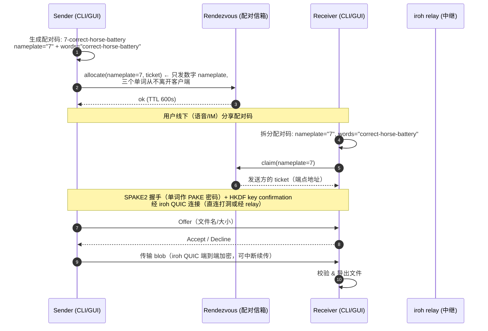

# WordDrop

**跨平台文件互传**：一句话配对码，端到端加密，无需账号，无需公网 IP。

> Cross-platform secure file transfer. Pair with a short word-code, transfer
> end-to-end encrypted, no account or public IP required.

## What / Why（这是什么 / 为什么）

想从一台机器把文件传到另一台机器？不需要注册账号、不需要建房间、不需要公网 IP，
只要念出一句配对码（例如 `7-correct-horse-battery`），传输全程加密。

- **免账号**：没有注册、没有好友关系，配对码一次一用，用完即焚。
- **免公网 IP**：NAT 打洞优先，打洞失败自动走中继（relay）；中继只转发密文。
- **端到端加密**：配对用 SPAKE2（三个单词即密码），传输走 iroh QUIC，内容只有两端可见。
- **可自托管**：配对信箱（rendezvous）与中继（relay）都可自行部署，不依赖第三方云服务。
- **断点续传**：传输中断后重新配对，即可从断点继续。

为什么配对码是「数字 + 三个单词」而不是一个普通密码？数字 nameplate 只在信箱里挂号，
三个单词才是真正的密码，二者在物理上分离。见[安全模型](#security-model-安全模型)。

## Status（状态）

- **v0.2.1 已发布**：[GitHub Releases](https://github.com/koucpy001/worddrop/releases/tag/v0.2.1)，
  提供 Linux / Windows / macOS 与 Android 的预编译产物（见[下载](#download-下载)）。
- **仓库公开**：[github.com/koucpy001/worddrop](https://github.com/koucpy001/worddrop)，
  CI 三平台（Linux / Windows / macOS）构建与测试全部通过。
- **Android 已签名**：release APK 使用正式密钥签名（CN=WordDrop），可直接安装。
- **真机验证**：Android 真机清单部分通过（安装、权限、地址配置），传输类步骤因
  手机侧网络问题待复测，暂未声明已验证。

## Download (下载)

Release v0.2.1：<https://github.com/koucpy001/worddrop/releases/tag/v0.2.1>

| 资产 | 平台 | 说明 |
| :--- | :--- | :--- |
| `worddrop-linux-cli.zip` | Linux x86_64 | 命令行工具（`worddrop`） |
| `worddrop-linux-app.zip` | Linux x86_64 | 桌面 GUI |
| `worddrop-windows-cli.zip` | Windows x86_64 | 命令行工具（`worddrop.exe`） |
| `worddrop-windows-app.zip` | Windows x86_64 | 桌面 GUI |
| `worddrop-macos-app.zip` | macOS | 桌面 GUI（未签名） |
| `app-release.apk` | Android（arm64-v8a / armeabi-v7a / x86_64） | release 签名 APK，可直接安装 |
| `sha256sums.txt` | - | 前五个 zip 的 SHA-256 校验清单 |

校验下载：`sha256sum -c sha256sums.txt`（Windows 可逐个用
`certutil -hashfile <file> SHA256` 比对）。

## Install (安装)

### Linux CLI

```sh
# 源码构建
cargo build --release
install -m 0755 target/release/worddrop ~/.local/bin/
```

也可直接下载 `worddrop-linux-cli.zip`，解压后 `chmod +x worddrop` 放入 `PATH`
（非静态链接，依赖系统 glibc）。

### Android

安装 `app-release.apk`（首次需允许「安装未知来源应用」）。release 构建使用正式密钥
签名（CN=WordDrop）；本地缺少 `key.properties` 时回退到 debug 签名，回退包仅用于自用。

### Windows / macOS

GitHub Actions 在 tag 推送时自动构建并发布。两平台均为**未签名**构建，安装时会有系统警告：

- **Windows**：SmartScreen 提示「未知发布者」，点「更多信息」→「仍要运行」。
- **macOS**：Gatekeeper 阻止直接打开，右键点击 `.app` → **打开**。
  （公证需要付费 Apple Developer 账号，本项目不做。）

## Usage (使用)

### CLI 发送 / 接收

发送方（打印一行配对码）：

```sh
worddrop send ~/photos/vacation/ ~/notes.txt
```

接收方（交互输入配对码，或直接用 `--code` 指定）：

```sh
worddrop receive
worddrop receive --code 7-correct-horse-battery --output ~/Downloads
```

- 配对码格式 `N-word-word-word`：数字为 1-9999 的 nameplate，三个单词取自 256 词
  的 PGP 词表。
- 接收方可选 `-o/--output <dir>` 指定保存目录（默认当前目录）。
- 传输中断后重新执行 `receive`（同一目录、同一数据目录），会提示「继续上次传输?
  [y/N]」，基于已下载的部分继续。

### 配置（服务地址）

客户端默认指向本机（`http://127.0.0.1:8080` rendezvous + `http://127.0.0.1:3340`
relay），开箱即用于本机 / 局域网 / 离线场景。使用自托管或公共服务时，两端都要设置，
两种方式任选（环境变量优先级最高）：

```sh
# 环境变量
export WORDDROP_RENDEZVOUS_URL=https://pair.worddrop.cloud
export WORDDROP_RELAY_URL=https://relay.worddrop.cloud

# 配置文件（env > file > default）
worddrop config set rendezvous_url https://pair.worddrop.cloud
worddrop config set relay_url https://relay.worddrop.cloud
worddrop config get
```

| 配置项 | 环境变量 | 默认值 |
| :--- | :--- | :--- |
| rendezvous URL | `WORDDROP_RENDEZVOUS_URL` | `http://127.0.0.1:8080` |
| relay URL | `WORDDROP_RELAY_URL` | `http://127.0.0.1:3340` |
| 数据目录 | `WORDDROP_DATA_DIR` | 平台默认配置目录（按 send/receive 角色分子目录） |
| 配置目录 | `WORDDROP_CONFIG_DIR` | 平台默认配置目录 |

`pair.worddrop.cloud` 与 `relay.worddrop.cloud` 是项目自托管的公共演示服务
（见[自托管](#self-host-自托管)）。GUI 在设置页填写同样的地址，与 CLI 共用一份配置。

### GUI（Flutter）

GUI 与 CLI 共享同一核心（crates/core，经 FRB bridge 调用），界面为中文：

- **传输**（主页）：发送 / 接收两个入口。
- **发送文件**：选文件 → 显示配对码 → 等待对方 → 进度条。
- **接收文件**：输入配对码 → 确认对方文件列表 → 进度条。
- **传输列表**：历史记录（完成 / 失败 / 已取消）。
- **设置**：服务地址、覆盖策略等。

支持平台：Linux desktop、Android。注意：Android 设备上的服务地址不能写
`127.0.0.1`，须填服务端的局域网 IP 或公网地址。

## Architecture (架构)

### 组件

```
┌─────────────────────┐   ┌─────────────────────┐
│  Sender             │   │  Receiver           │
│  CLI / Flutter GUI  │   │  CLI / Flutter GUI  │
│  ┌───────────────┐  │   │  ┌───────────────┐  │
│  │  worddrop-core │  │   │  │  worddrop-core │  │
│  │  (SPAKE2,     │  │   │  │  (SPAKE2,     │  │
│  │  session,     │  │   │  │  session,     │  │
│  │  iroh blobs)  │  │   │  │  iroh blobs)  │  │
│  └───────┬───────┘  │   │  └───────┬───────┘  │
└──────────┼──────────┘   └──────────┼──────────┘
           │ ① nameplate only        │ ③ claim nameplate
           │   (数字, 无单词)          │
           ▼                          ▼
     ┌─────────────────────────────────────┐
     │  worddrop-rendezvous (配对信箱)        │
     │  code <-> ticket · one-shot claim   │
     │  TTL 600s · rate limits · /health   │
     └─────────────────────────────────────┘
           ▲                          ▲
           │ ② SPAKE2 over iroh       │
           │    (单词是密码, 只走 iroh)  │
           └────────────┬─────────────┘
                        ▼
              ┌─────────────────────┐
              │  iroh relay (中继)   │
              │  只转发密文, 无法解密  │
              │  NAT 打洞失败时兜底    │
              └─────────────────────┘
```

### 配对流程 (pairing flow)



关键点：**nameplate 与 words 分离**。rendezvous 只见数字 nameplate（挂号用），
words（真正的密码）只存在于两端客户端之间、经 SPAKE2 协商，永不经过 rendezvous。

## Security model (安全模型)

### 分层：谁能看到什么

| 组件 | 能看到 | 不能看到 |
| :--- | :--- | :--- |
| rendezvous（配对信箱） | 数字 nameplate、ticket（端点地址）、时间戳 | 三个单词、会话密钥、文件内容 |
| iroh relay（中继） | 密文流（QUIC 载荷）、元数据流量 | 明文文件、配对密码 |
| 网络嗅探者 | 与 relay 相同（未用 TLS 时含 nameplate/ticket 明文） | 单词、文件内容 |
| 对方客户端 | 协商后的文件内容 | 你的持久身份密钥（ed25519，本地保存） |

### 1. nameplate / password 拆分

配对码 `N-word-word-word` 拆成两部分，职责完全分离：

- **nameplate**（数字 1-9999）：只是信箱里的「挂号号牌」。客户端把它发给
  rendezvous，用于让对方找到自己。它本身没有任何秘密，任何人看到 `7` 都毫无意义。
- **三个单词**：真正的密码（PAKE 密码）。**从不离开客户端**，不经过 rendezvous、
  不经过 relay，只参与两端的 SPAKE2 协议。

这个拆分是安全模型的根基：即使 rendezvous 被攻破，攻击者拿到的也只是
「有人用号码 7 挂号了」这类信息，**得不到任何能冒充发送方或解密传输的东西**。

### 2. SPAKE2 配对认证

- 三个单词即 PAKE（Password-Authenticated Key Exchange）密码，两端各发一条 33
  字节消息，派生 32 字节会话密钥。
- 随后做 **HKDF key confirmation**（16 字节确认令牌）：只有单词完全一致的两端
  才能通过确认；单词不一致 → 确认失败 → 配对终止，不传输任何数据。
- PAKE 的性质：密码从不以可离线破解的形式出现在线上（无明文传输、无字典攻击面）。

### 3. iroh QUIC 传输层端到端加密

文件内容走 iroh（QUIC-over-TLS）连接传输，**端到端加密**。relay 的角色是
「不知道内容的快递员」：它转发的是密文，无法读取文件内容，也无法解密。

### 威胁模型（Threat model）

> **诚实声明**：说「relay 无法解密」的前提是 iroh 传输层端到端加密成立。
> 而 E2E 之所以可信，恰恰来自下面的 nameplate/words 拆分：早期设计若把完整
> 配对码交给 rendezvous，恶意 rendezvous 就能直接中间人（MITM）。正是
> nameplate/words 拆分 + SPAKE2 封死了这条路。

- **恶意/被攻破的 rendezvous**：它可以**替换 ticket**，把接收方引导到攻击者自己
  的节点。但攻击者拿不到三个单词，就无法通过 key confirmation，接收方会在配对
  阶段发现（确认失败），不会传输任何文件。**这就是 SPAKE2 的意义**：它把
  「信箱管理员不可信」变成了「信箱管理员捣乱也没用」。
- **恶意/被攻破的 relay**：oblivious（视而不见）。它只能转发密文，没有解密密钥。
  即使 relay 与 rendezvous 串通，也只能做 ticket 替换级别的干扰，依然过不了
  SPAKE2 配对关。
- **网络嗅探者**：生产环境走 TLS（relay 是 wss，rendezvous 是 https），嗅探者
  看到的是密文；即使看到 nameplate/ticket 明文（dev 模式），也没有任何秘密可言。
- **重放攻击**：nameplate 一次性 claim，claim 后立即作废（one-shot），重复 claim
  返回 404；TTL 600s 过期即失效。
- **离线暴力破解**：256 词词表取 3 个不同单词，组合空间 256×255×254 ≈ 1.66×10⁷。
  数字不大，但 SPAKE2 的 key confirmation 使每次猜测都需要一次实时握手（不能离线
  批量验证），且 rendezvous 有速率限制、配对码 600s 过期，对在线猜测的防护足够。

**残余风险（诚实列出）**：

1. 三个单词只有约 24 bits 熵，不要把配对码发到公开场合；语音/私聊传递是设计预期
   场景。
2. dev 模式（relay `--dev` + 无 TLS rendezvous）下 nameplate/ticket 明文传输，
   局域网嗅探者能看到谁在跟谁配对（看不到内容）。生产必须 TLS。
3. 身份密钥（ed25519）保存在本地；丢 key 不会丢文件，但会换身份。

## Self-host (自托管)

配对服务（rendezvous）与中继（iroh-relay）都可以自托管，完整部署文档见
**[`deploy/README.md`](deploy/README.md)**，这里只给要点：

- **Docker Compose**：一台 VPS 一条命令起两个容器，生产模式内置 Caddy 自动申请
  Let's Encrypt 证书终结 TLS，无需人工生成证书。
- **systemd**：裸机 / 不想用 Docker 时的替代方案。
- 防火墙只需放行 80/443 TCP（Caddy 终结 TLS）；不开任何 UDP 端口，客户端的 relay
  数据路径是 WebSocket-over-TLS。
- 部署完成后，两端把 `WORDDROP_RENDEZVOUS_URL` / `WORDDROP_RELAY_URL` 指向自己的
  域名即可。

项目自托管的公共演示服务跑在 `pair.worddrop.cloud`（rendezvous）与
`relay.worddrop.cloud`（relay），可直接用于体验或日常使用。

## Development (开发指南)

### 环境准备

| 依赖 | 版本 | 说明 |
| :--- | :--- | :--- |
| Rust toolchain | 1.97.1 | `rust-toolchain.toml` 已固定 |
| Flutter | 3.44.9 (Dart 3.12.2) | Linux desktop 需要 clang / ninja-build / pkg-config / libgtk-3-dev / liblzma-dev |
| Android SDK | AGP 8.11.1 + Kotlin 2.2.20 + NDK 28.x | 仅构建 Android 需要（minSdk 26） |
| iroh-relay | 1.0.3 | 本地 e2e 与联调的硬依赖，`cargo install iroh-relay --version 1.0.3 --features server` |

中国大陆网络可配置 rsproxy 镜像加速 crates.io（CI 无需配置，runner 可直连）。

### 本地运行

```sh
# 1. 起 relay（dev 模式，端口 3340）
iroh-relay --dev

# 2. 起 rendezvous（默认 127.0.0.1:8080）
worddrop-rendezvous

# 3. 两个终端分别发送 / 接收
worddrop send <path>
worddrop receive --code <word-code>
```

内存紧张的主机建议用 `-j 2` 构建。send 与 receive 的数据目录按角色分离
（`<data_dir>/send`、`<data_dir>/receive`），不要手动改到一起（iroh-blobs 的
redb 数据库是单进程独占的）。

### 测试

```sh
cargo test --workspace -j 2          # Rust 全量（含 7 个端到端用例）
cargo test -j 2 -p worddrop_bridge --manifest-path flutter/rust/Cargo.toml  # FRB 桥接层
cd flutter/app && flutter test       # Flutter widget 测试（hermetic）
cargo clippy --workspace -- -D warnings
cargo fmt --check
```

端到端用例依赖 `~/.cargo/bin/iroh-relay`（先查该路径再查 `PATH`）。

## License

MIT，见 [LICENSE](LICENSE)。
